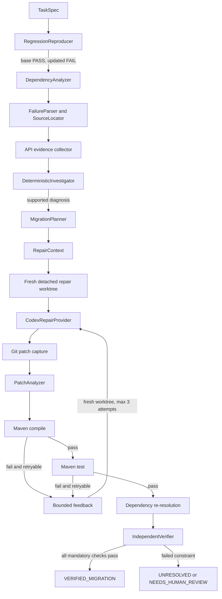

# BumpShield architecture

BumpShield separates deterministic investigation and verification from one
narrow AI responsibility: proposing source edits. This boundary makes every
accepted migration reproducible and auditable.

## System flow



The provider never decides whether a patch is correct. Git records actual
changes; Maven and the independent verifier determine the outcome.

## Component responsibilities

### RegressionReproducer

Creates detached base and updated worktrees, runs Maven tests in each, and
requires a working base plus failing updated revision before analysis proceeds.
It never checks out commits in the original repository.

### DependencyAnalyzer

Runs Maven dependency resolution for both revisions and compares active
artifacts by Maven identity. It preserves direct/transitive relationships and
dependency paths, including the path from the requested target upgrade to a
changed transitive dependency.

### FailureParser and SourceLocator

Classifies common Javac and Surefire failures, retains bounded failure excerpts,
and resolves source locations only inside the isolated workspace. Path
traversal and escaping symlinks are rejected.

### API evidence collector

Uses Maven's resolved artifact paths, reads JAR contents without extraction,
attributes relevant classes to dependencies, and compares public declarations
with bounded `javap -public` execution. Missing or ambiguous evidence stays
explicit rather than becoming a guessed cause.

### DeterministicInvestigator

Consumes the existing evidence bundle and ranks typed causal hypotheses with
frozen deterministic rules. A supported hypothesis links the target upgrade,
dependency change, API change, project usage, and observed failure. Scores are
ordinal evidence strengths, not probabilities.

### MigrationPlanner

Transforms a supported diagnosis into a typed migration plan. It finds
conservative Java usages, distinguishes compiler-localized failures from
potential lexical matches, bounds initially allowed files, records protected
files and anti-cheating constraints, and exposes new API declarations only as
candidates. It does not generate a patch.

### RepairEngine and CodexRepairProvider

The repair engine creates a fresh detached worktree at `updated_commit` for each
attempt. The provider receives bounded diagnosis, plan, snippets, candidate APIs,
allowed files, constraints, and prior failure feedback. Codex may propose edits;
it cannot certify them. Attempts are capped at three and preserved separately.

### PatchAnalyzer

Treats Git as ground truth. It records exact diffs and statistics, compares
modified files with planned scope, and detects deterministic safety signals such
as dependency changes, deleted tests, newly disabled tests, and test-skip
configuration.

### IndependentVerifier

Accepts structured execution and patch evidence, not provider claims. Mandatory
checks cover target and causal dependency resolution, compile, tests, test
integrity, test execution, prohibited changes, and patch scope. Only unanimous
mandatory success yields `VERIFIED_MIGRATION`.

### BenchmarkRunner

Loads typed benchmark manifests, validates base/updated behavior, schedules
strategies deterministically, persists every trial immediately, and applies the
same verifier to every repair strategy. Ground truth is used only after
execution for scoring. Provider outages pause later work rather than fabricating
repair failures.

## Deterministic and AI boundary

| Deterministic | AI |
|---|---|
| Git isolation and diff capture | Source-edit proposal through Codex |
| Maven reproduction and dependency analysis | |
| Failure parsing and source localization | |
| JAR ownership and `javap` API comparison | |
| Causal diagnosis and migration planning | |
| Patch safety analysis | |
| Compile, test, dependency, and integrity checks | |
| Benchmark validation, scheduling, scoring, and reports | |

No diagnosis agent, semantic verifier, or model-authored success status exists
in the MVP.

## Isolation and security invariants

- Original repositories are read-only from BumpShield's perspective.
- Analysis and repair use BumpShield-owned detached worktrees.
- Persistent state is required to live outside analyzed repositories.
- Workspace paths are resolved and checked before reads or writes.
- JAR evidence collection does not execute dependency code.
- External commands use argument arrays through `CommandRunner`; no shell command
  strings or `shell=True` are used.
- Repair attempts do not commit, push, or open pull requests.
- Temporary worktrees are removed; patches and evidence remain external.

## Main data products

```text
EvidenceBundle
    contains regression, dependency, failure, source, API, and path evidence

CausalDiagnosis
    contains status, primary hypothesis, causal chain, strength, and score

MigrationPlan
    contains required outcome, affected API/locations, candidates, boundaries,
    constraints, verification requirements, and scope estimate

RepairContext
    contains only bounded evidence needed by the repair provider

RepairAttempt
    contains provider result, Git patch, safety analysis, execution, and feedback

VerificationResult
    contains typed independent checks and final verification status

MigrationReport
    contains task, diagnosis, plan, attempts, winning patch, and final status
```

## Artifact ownership

Run artifacts are immutable evidence outside the analyzed repository. Planning
does not write project source. Repair writes only its disposable worktree. A
winning patch remains an external `final.patch`; applying it is an explicit user
decision.

## Evaluation freeze

BUMP-FINAL-v1 used a frozen prompt, causal policy, verifier policy, strategy
budget, schedule, and dataset. Final configuration and dataset hashes are
recorded in [final research results](final-research-results.md). Phase 10 changes
documentation and generated repository debris only; it does not change the
algorithm or evaluation.
